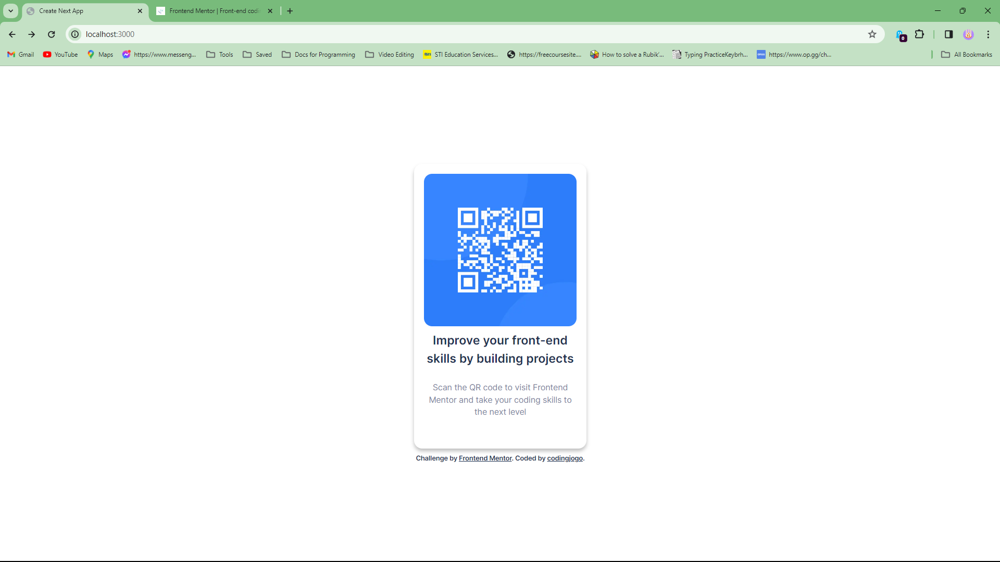
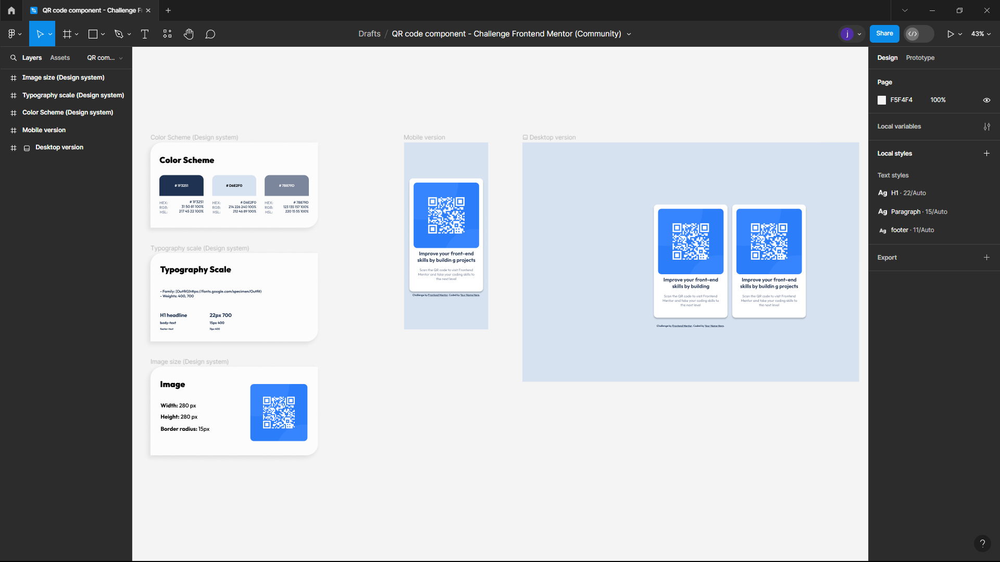

This is a [Next.js](https://nextjs.org/) project bootstrapped with [`create-next-app`](https://github.com/vercel/next.js/tree/canary/packages/create-next-app).

## Getting Started

First, run the development server:

```bash
npm run dev
# or
yarn dev
# or
pnpm dev
# or
bun dev
```

Open [http://localhost:3000](http://localhost:3000) with your browser to see the result.

You can start editing the page by modifying `app/page.tsx`. The page auto-updates as you edit the file.

This project uses [`next/font`](https://nextjs.org/docs/basic-features/font-optimization) to automatically optimize and load Inter, a custom Google Font.

## Learn More

To learn more about Next.js, take a look at the following resources:

- [Next.js Documentation](https://nextjs.org/docs) - learn about Next.js features and API.
- [Learn Next.js](https://nextjs.org/learn) - an interactive Next.js tutorial.

You can check out [the Next.js GitHub repository](https://github.com/vercel/next.js/) - your feedback and contributions are welcome!

## Deploy on Vercel

The easiest way to deploy your Next.js app is to use the [Vercel Platform](https://vercel.com/new?utm_medium=default-template&filter=next.js&utm_source=create-next-app&utm_campaign=create-next-app-readme) from the creators of Next.js.

Check out our [Next.js deployment documentation](https://nextjs.org/docs/deployment) for more details.

# Frontend Mentor - QR code component solution

This is a solution to the [QR code component challenge on Frontend Mentor](https://www.frontendmentor.io/challenges/qr-code-component-iux_sIO_H). Frontend Mentor challenges help you improve your coding skills by building realistic projects. 

## Table of contents

- [Overview](#overview)
  - [Screenshot](#screenshot)
  - [Links](#links)
- [My process](#my-process)
  - [Built with](#built-with)
  - [What I learned](#what-i-learned)
  - [Continued development](#continued-development)
  - [Useful resources](#useful-resources)
- [Author](#author)
- [Acknowledgments](#acknowledgments)

**Note: Delete this note and update the table of contents based on what sections you keep.**

## Overview

### Screenshot



### Links

- Solution URL: [repository | codingjogo](https://your-solution-url.com)
- Live Site URL: [github pages](https://your-live-site-url.com)

## My process

### I created first the structure of the semantic HTML
#### root/components/CardWrapper.tsx
```
<Card>
    <CardHeader />

    <CardContent />
</Card>
```

### Then I setup my styles with "tailwind.config.ts"
```
theme: {
		screens: {
			mobile: "375px",
			// => @media (min-width: 375px) { ... }

			desktop: "1440px",
			// => @media (min-width: 1440px) { ... }
		},
		fontSize: {
			sm: "12px", // 0.8 * 15
			base: "15px", // Same as baseFontSize
			xl: "18.75px", // 1.25 * 15
        ...
```

### Then I start adding classes with [Tailwind](https://tailwindcss.com/)
```
const Card = ({children} : {children: React.ReactNode;}) => {
  return (
    <!-- className="w-[315px] h-[484] shadow-main ..." -->
    <div className='w-[315px] h-[484] shadow-main flex flex-col p-[18px] pb-11 rounded-[15px] gap-y-2 font-outfit text-center'>
        {children}
    </div>
  )
}
```

### Built with

- Semantic HTML5 markup
- CSS custom properties
- Flexbox
- [React](https://reactjs.org/) - JS library
- [Next.js](https://nextjs.org/) - React framework
- [Tailwind](https://tailwindcss.com/) - For styles

### What I learned

I learn how to style with [Tailwind](https://tailwindcss.com/) and using custom properties on file of "tailwind.config.ts" and apply that to my className(s).

### Continued development

Use this section to outline areas that you want to continue focusing on in future projects. These could be concepts you're still not completely comfortable with or techniques you found useful that you want to refine and perfect.

**Note: Delete this note and the content within this section and replace with your own plans for continued development.**

Can you guys send me a link that I can build full stack Next.js with prisma and postresql or mongodb?

### Useful resources

- [Figma Design](https://www.figma.com/file/SVrOFV7zUdqtrhy2Whkzur/QR-code-component---Challenge-Frontend-Mentor-(Community)?type=design&node-id=0%3A1&mode=design&t=oOZ22gsLjoli8w6n-1) - I saw this on google and saw the pixels of every aspects of the components.

## Author

- Facebook - [Joshua Gonzales](https://www.facebook.com/profile.php?id=61556179213130)
- Frontend Mentor - [@codingjogo](https://www.frontendmentor.io/profile/codingjogo)

## Acknowledgments

### Figma design:



** NOTE THAT THIS IS FROM GOOGLE THAT I'VE [SEARCHED](https://www.figma.com/community/file/1230752484447419877) **